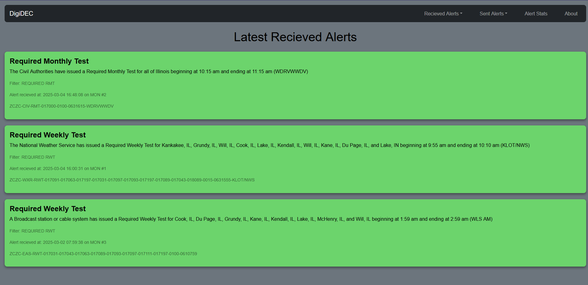
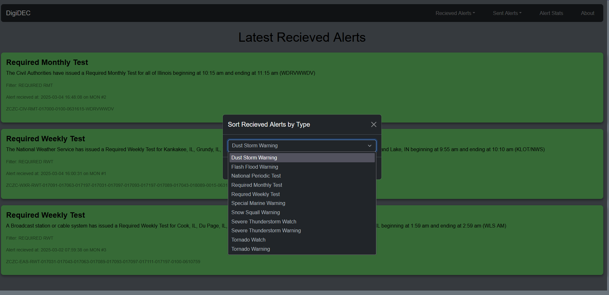
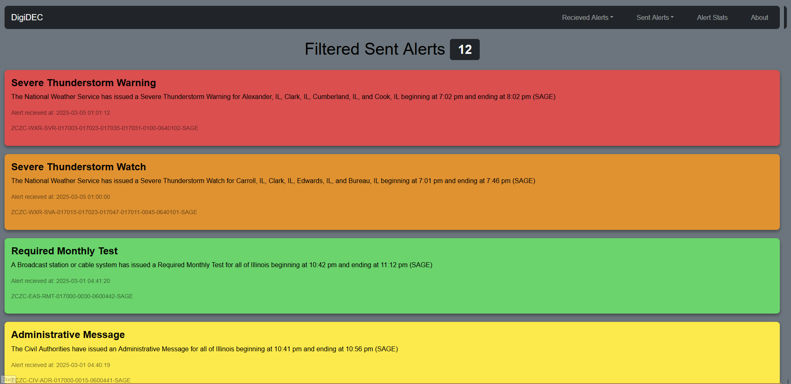
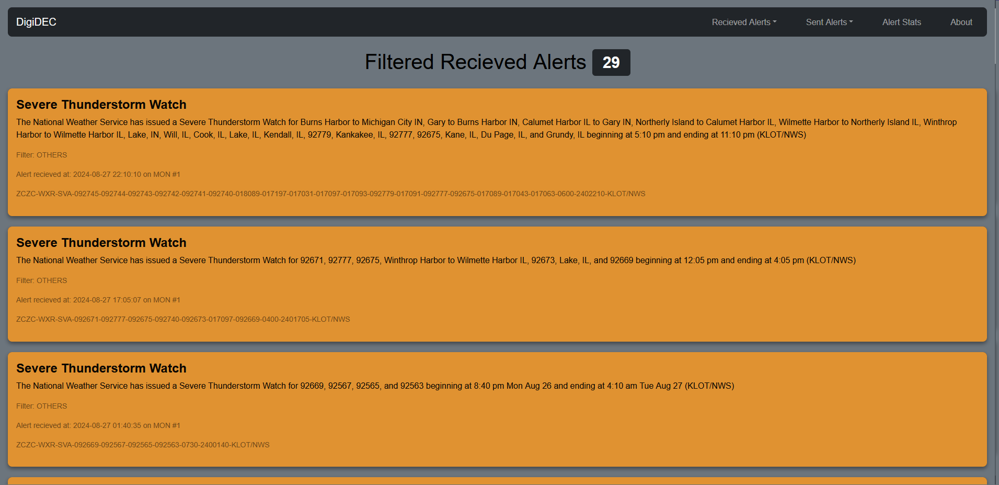
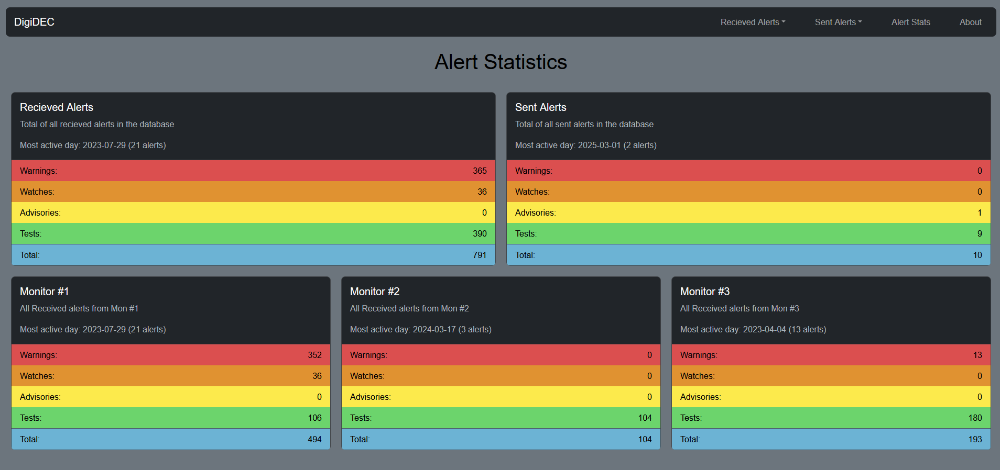
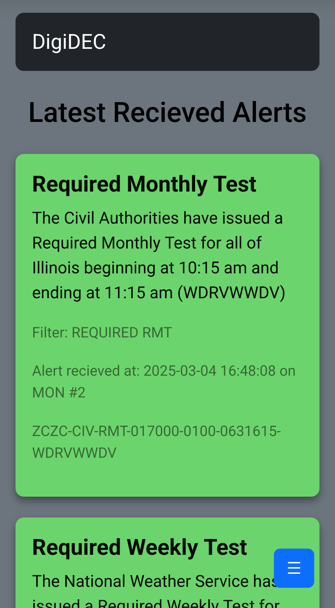
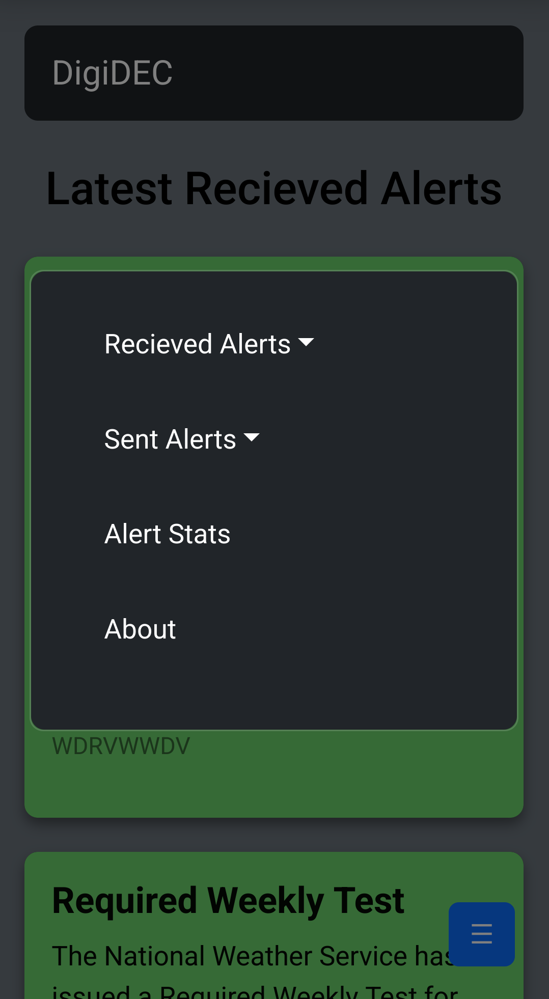
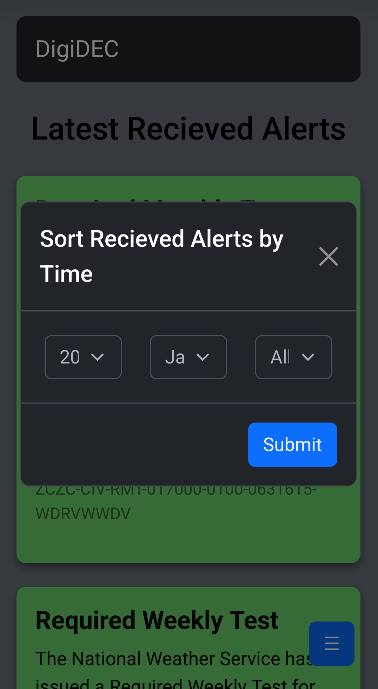
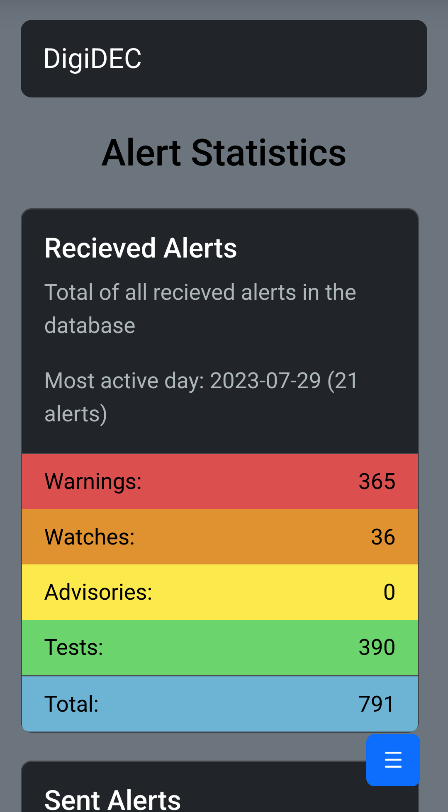

# DigiDEC - SAGE EAS Endec Serial/Telnet Logging Software with Discord Webhook integration

### DigiDEC is software written in Python to parse, log, and display emergency alerts recieved by the Sage EAS ENDEC model 1822 via local serial connection (WIP) or a remote serial server.


# Features

✔️ Telnet based serial server support

✔️ MySQL database logging

✔️ PHP, Bootstrap, and Popper based web front end pages to review alerts

✔️ Basic alert statistics like most active day and alert count

✔️ Per-event code, category, and year/month data sorting

✔️ Discord webhook integration

# What's needed to run
* apache2 
* php8.1
* php8.1-mysql
* python 3.10 thru 3.12 (telnetlib is removed in >3.13, switch statements introduced 3.10)
* python3-pip
    * mysql-connector-python
    * discord_webhook

# Database Schema

```
CREATE DATABASE digidec_rx_log;
CREATE DATABASE digidec_tx_log;
```

```
USE digidec_rx_log;
CREATE TABLE alerts(
    EVENT_TXT varchar(50), 
    EVENT_CODE char(3), 
    FILTER text, 
    MON tinytext, 
    DESCR text, 
    ZCZC_STR text,
    TYPE varchar(8),
    TIMESTP datetime
);
```
```
USE digidec_tx_log;
CREATE TABLE digidec_tx_log(
    EVENT_TXT varchar(50), 
    EVENT_CODE char(3), 
    FILTER text, 
    MON tinytext, 
    DESCR text, 
    ZCZC_STR text,
    TYPE varchar(8),
    TIMESTP datetime
);
```

# Installation

1. Clone the repo into a suitable directory where you wish to run the main python scripts

2. Install/ensure the python dependencies listed above are on your target system (Ubuntu server is recommended) and PHP is functional for your apache install

3. Create the directory `/var/www/html/digidec` and copy the contents of `html_front_end` into it

4. Copy the `10-digidec_web_config.conf` file to your `/etc/apache2/sites-available` directory
    * Make sure to check the apache site configs if you are using a different webroot!

5. Link the conf file from sites-available to sites-enabled using `sudo ln /etc/apache2/sites-available/10-digidec_web_conf.conf /etc/apache2/sites-enabled` to enable it in apache

    * Be sure to run `sudo service apache2 reload` to reload the configs after linking

6. Rename `DEFAULT_db_creds.ini` to `db_creds.ini` and populate with the appropriate credentials and database names if different from default

7. Run the `core.py` script with python3 to check functionality

8. If everything functions as intended, copy the `digidec.service` file to `/etc/systemd/system` and run `sudo systemctl daemon-reload` and `sudo systemctl enable digidec.service` to enable running at startup. If the service isn't already running, run `sudo systemctl start digidec.service`


# Configuration

### Before anything, if you are using a Lantronix serial server, read this!
By default, the UDS200 (And 2000 I believe) cache unread bytes recieved on the serial ports and output them when the telnet interface is accessed. We dont want this! It can cause duplicates. To turn this feature off (to the best of my knowledge), do the following:

* Telnet in on the configuration interface (usually port 9999)
* press 1 or 2 to select which channel/port your endec is on
* ensure your baudrate is matching the endec's
* keep pressing enter until you reach FlushMode and set the value to `11`, which in the manual corresponds (in binary) to turning off the caching feature
* once you are back at the main configuration screen, be sure to save your settings!

## Endec setup
This part is easy, just go into the endec's menu under the devices option and select a desired COM port. Set the device type to news feed. Make sure your baud rate is the same on the serial port as your serial server/server's port.

## Configuration for the MySQL database and PHP database names are found within the `DEFAULT_db_creds.ini` file. 

* You MUST rename this to `db_creds.ini` and populate it with the appropriate values for your setup before the application will function!


## Configuration parameters for the base application are found within the `settings.json` file
* `embed`

    * `alert_colors`
    Colors of the accent bar on the left hand side of Discord webhood messages, they default to the same colors as the UI cards.


* `webhook`

    * `##_url` - Your Discord webhook URL(s) goes here

    * `zczc_str_enable` - Enable or disable putting the ZCZC EAS message string in the Discord embed

    * `enable_tx_alerts` - Enable or disable webhook messages of alerts originated from the endec itself (ie, sent from the control panel)

    * `enable_rx_alerts` - Enable or disable webhook messages of alerts recieved via monitor ports on your endec. This is kinda the main feature so I'd leave this on...

    * `mon_num_enable` - Enable or disable displaying which monitor input the alert was recieved on in the webhook message

    * `filter_display_enable` - Enable or disable displaying which alert filter was matched when the alert was recieved in the webhook message

* `telnet`
    * `ip` - IP of your Lantronix or similar serial server
    * `port` - Port that you can telnet into for access to the endec serial port

* `mysql`
    * `server_ip` - IP of your MySQL server
    * `user` - Username of your MySQL user
    * `pass` - Password of your MySQL user

* `general`
    * `webui_url` - URL of your DigiDEC web interface (for embed linking if enabled)

#

# Desktop Screenshots


Screenshot of the landing page UI (3 most recent alerts)


Screenshot of a sorting modal


Screenshot of the sent alerts page (all alerts sent, no filtering)


Screenshot of the recieved alerts page, showing all Severe Thunderstorm Watches


Screenshot of the stats page


# Mobile Screenshots


Screenshot of the mobile landing page UI (3 most recent alerts)


Screenshot of the mobile hamburger menu


Screenshot of a mobile sorting menu


Screenshot of the stats page on mobile